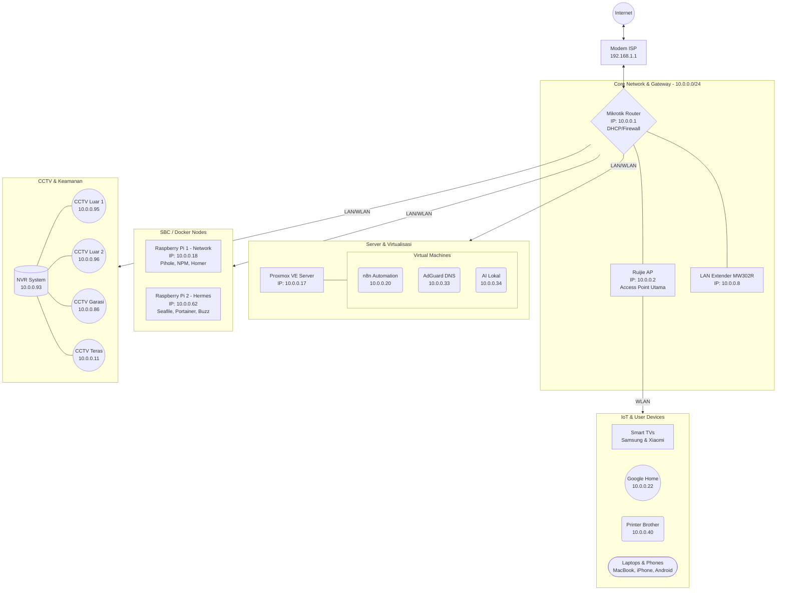

# Arsitektur & Topologi Jaringan Homelab

Berdasarkan *mapping* terbaru dari DHCP Lease & ARP Table Mikrotik, jaringan homelab ini terbagi menjadi beberapa segmen fungsi (Infrastruktur, Virtualisasi, Container/SBC, Keamanan/CCTV, dan Perangkat Pengguna).

## 🗺️ Diagram Topologi Lengkap (Mermaid)

## 🖥️ Daftar Perangkat Jaringan (Network Inventory)

### 1. Perangkat Core & Network
| Perangkat | IP Address | MAC Address | Keterangan |
| :--- | :--- | :--- | :--- |
| **Mikrotik Router** | `10.0.0.1` | - | Gateway utama jaringan. |
| **Ruijie AP** | `10.0.0.2` | `10:82:3D:DB:9C:01` | Access Point penyebar Wi-Fi utama. |
| **LAN Extender** | `10.0.0.8` | `30:16:9D:A3:9B:B4` | Extender jaringan. |

### 2. Server & Node Komputasi
| Perangkat | IP Address | Keterangan |
| :--- | :--- | :--- |
| **Proxmox VE Server** | `10.0.0.17` | Server Virtualisasi Utama (Bare-metal). |
| **VM: n8n** | `10.0.0.20` | Sistem otomasi *workflow*. |
| **VM: AdGuard** | `10.0.0.33` | DNS *ad-blocker* alternatif. |
| **VM: AI Lokal** | `10.0.0.34` | Sistem AI yang berjalan lokal. |
| **Raspberry Pi 1** | `10.0.0.18` | Docker Engine (Pihole, NPM, Uptime Kuma). |
| **Raspberry Pi 2 (Hermes)** | `10.0.0.62` | Docker Engine (Seafile, Buzz, Portainer). |

### 3. Keamanan & CCTV (Surveillance)
| Perangkat | IP Address |
| :--- | :--- |
| **NVR System** | `10.0.0.93` |
| **CCTV Area Luar 1** | `10.0.0.95` |
| **CCTV Area Luar 2** | `10.0.0.96` |
| **CCTV Garasi** | `10.0.0.86` |
| **CCTV Teras Tamu** | `10.0.0.11` |

### 4. Smart Home & IoT
- **Google Home** (`10.0.0.22`)
- **Printer Brother** (`10.0.0.40`)
- **TV Samsung** (`10.0.0.5`)
- **Xiaomi TV** (`10.0.0.50`)

### 5. Klien / User
Terdiri dari berbagai gawai pribadi seperti *MacBook, iPhone, Android, Laptop Dell*, dan *Tablet* yang menggunakan alokasi IP dinamis dari DHCP server Mikrotik.
