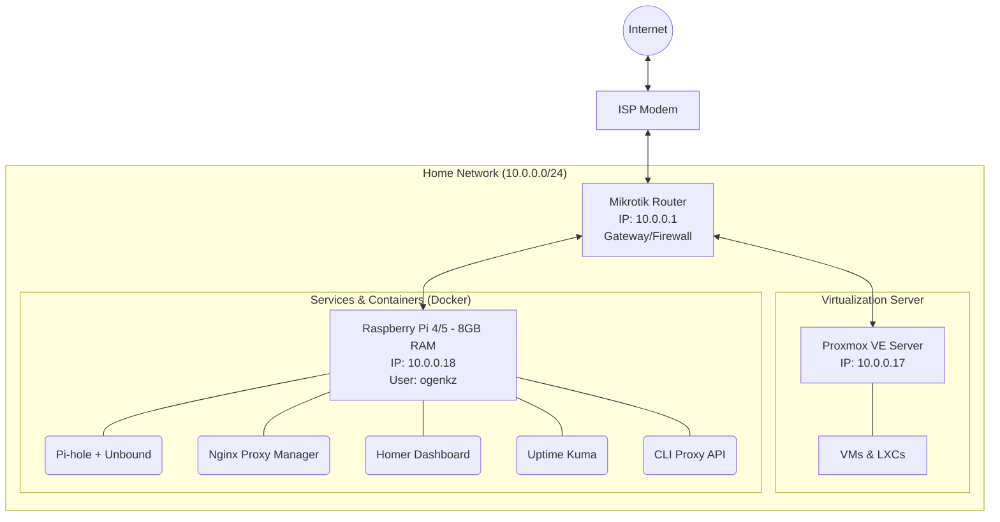

# Homelab Architecture

Dokumentasi detail dari infrastruktur homelab saat ini.

## 🏗️ Topologi & Arsitektur Jaringan

## 🖥️ Node & Infrastruktur

Berikut adalah rincian masing-masing node di dalam jaringan:

### 1. Mikrotik Router
*   **IP Address**: `10.0.0.1`
*   **Peran**: Bertindak sebagai *gateway* utama, pengatur *routing*, *firewall*, dan pengelola jaringan *homelab*.

### 2. Proxmox VE Server
*   **IP Address**: `10.0.0.17`
*   **Peran**: Server virtualisasi utama (*hypervisor*) untuk menjalankan berbagai Virtual Machine (VM) dan Linux Containers (LXC).

### 3. Raspberry Pi
*   **IP Address**: `10.0.0.18`
*   **Spesifikasi**: RAM 8GB
*   **Sistem**: Debian / Docker Environment (`172.17.0.x`, `172.18.0.x`, `172.19.0.x`)
*   **Akses SSH**: `ogenkz@10.0.0.18`
*   **Layanan Berjalan (Docker)**:
    *   **Pi-hole + Unbound** (`pihole/pihole` & `mvance/unbound-rpi`): Solusi *ad-blocking* dan *DNS resolver* internal.
    *   **Nginx Proxy Manager (NPM)** (`jc21/nginx-proxy-manager`): *Reverse proxy* (Port `81`, `443`, `8082`) untuk routing trafik layanan internal.
    *   **Homer** (`b4bz/homer`): *Dashboard* statis untuk homelab aksesibilitas (Port `8081`).
    *   **Uptime Kuma** (`louislam/uptime-kuma`): *Monitoring tool* untuk memantau status servis secara _real-time_.
    *   **CLI Proxy API**: Internal proxy service (Port `8317`, `51121`).

---
*Dokumentasi ini dibuat secara otomatis dan siap untuk diunggah ke repositori GitHub.*
