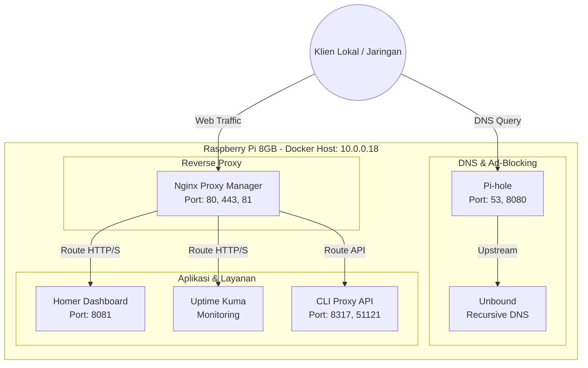

# 🐳 Docker Ecosystem & Services

Raspberry Pi (Node: `10.0.0.18`) didedikasikan secara penuh untuk menjalankan ekosistem Docker. Berikut adalah topologi mendetail dari kontainer yang saling terhubung.

## 🕸️ Arsitektur Kontainer Docker

Layanan-layanan di atas diletakkan pada bridge network Docker (termasuk `172.17.0.x`, `172.18.0.x`, dan `172.19.0.x`). NPM bertugas memetakan port internal ke domain agar mudah diakses.
